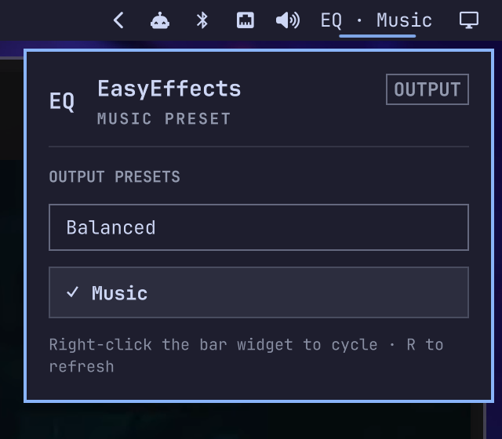

# EasyEffects Presets for Omarchy

A small Omarchy bar widget for switching between your EasyEffects output presets.

The widget reads presets from EasyEffects, shows the active preset in the bar, and verifies changes against the running EasyEffects process so the displayed state stays accurate.



## Features

- Left-click to open the preset list
- Right-click to cycle through presets
- Keyboard navigation inside the panel
- Live active-preset detection
- Friendly labels derived from preset filenames
- Protection against EasyEffects autoload rules immediately reverting a manual selection

## Requirements

- [Omarchy](https://omarchy.org/) with shell plugin support
- [EasyEffects](https://github.com/wwmm/easyeffects)
- At least one saved EasyEffects output preset
- `jq` (included with Omarchy)

## Install

Review the repository, then add the plugin:

```bash
omarchy plugin add https://github.com/nerdyworm/omarchy-easyeffects-presets.git
```

Accept the prompt to enable the plugin during installation.

For an unattended install from a repository you already trust:

```bash
omarchy plugin add https://github.com/nerdyworm/omarchy-easyeffects-presets.git --enable --yes
```

## Update

Review and install the next update:

```bash
omarchy plugin update nerdyworm.easyeffects-presets
```

Or update all Git-managed plugins:

```bash
omarchy plugin update --all
```

## Remove

Remove the plugin from Omarchy:

```bash
omarchy plugin remove nerdyworm.easyeffects-presets
```

This does not delete your EasyEffects presets. If the plugin disabled an
autoload rule, restore it using the instructions below before removing the
plugin.

## Usage

- Left-click the bar widget to open the preset list.
- Right-click the widget to switch to the next preset.
- Use the arrow keys and Enter in the panel to select a preset.
- Press `R` in the panel to refresh the preset list.

The widget discovers output presets in:

```text
~/.local/share/easyeffects/output
```

## EasyEffects autoload rules

An EasyEffects autoload rule can immediately restore a different preset after a manual switch. When this widget finds an autoload rule for the current output device, it moves that rule to:

```text
~/.local/state/omarchy/easyeffects-presets/autoload-disabled
```

The rule is preserved rather than deleted. To restore it, move the JSON file back to:

```text
~/.local/share/easyeffects/autoload/output
```

## Security and behavior

This plugin runs unsandboxed inside `omarchy-shell` when enabled. Review its source before installing it.

The plugin:

- Runs `easyeffects` to read and load output presets.
- Runs local shell tools to find presets and manage autoload rules.
- Reads EasyEffects preset, state, and autoload files in your home directory.
- Writes a local switch log under `~/.local/state/omarchy/easyeffects-presets`.
- Moves a matching autoload rule to the backup directory described above.
- Provides local IPC methods for status, preset selection, and cycling.
- Does not use the network or start a background service.

## Validate from source

Validate the plugin with:

```bash
omarchy plugin validate .
qmllint -I /usr/share/omarchy/shell BarWidget.qml
```

## License

[MIT](LICENSE)
